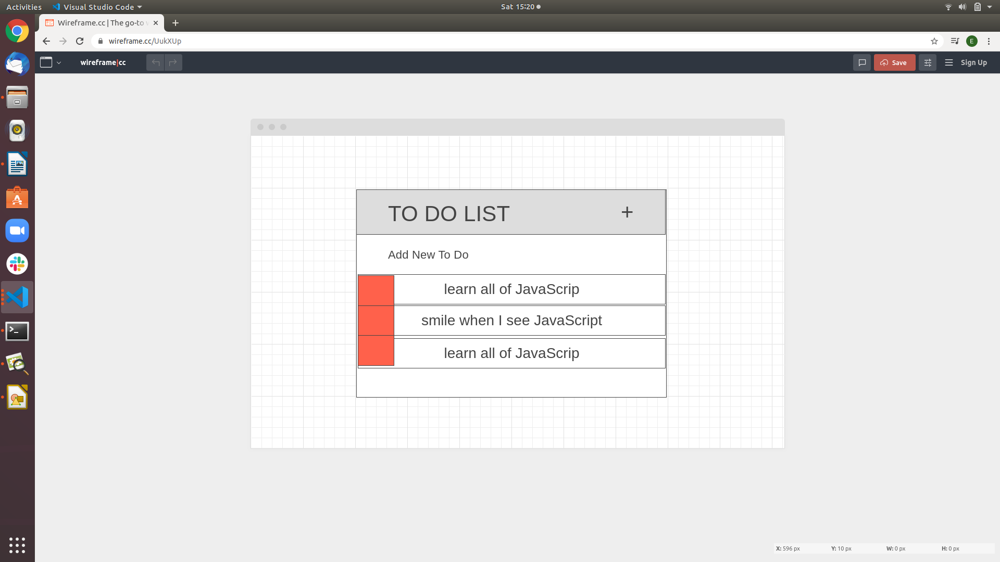

# To Do List project

...

---

## User Story Dependencies

[Story Dependency Diagram](https://excalidraw.com/)

---

## WIREFRAME

---

## 0.Setup

- Fork the repo from [encapsulation-week-1-starter](https://github.com/HackYourFutureBelgium/encapsulation-week-1-starter) and clone it.
- Create Backlog.
- Write development strategy.
- Create Project board.
- Turn on gitHub pages.

---

## 1. Initialize Application

__As a user I want to see the initial page when I load the site__

### REPO

- This user story is developed on branch `init`.
- This branch is merged to `master` branch after completion.

### HTML

- Add a `
` element as a container.
- Add a `<h1>` element for for the title.
- Add an `<input>` to let the user add to do's.
- A `
` with id root was already in the template.

### CSS

- Add some styling

### JS

#### Listener

---

## 2. Add To Do

__As a user I want to be able to add to do's__

- __When the user type text in the input text box and press enter key a to do will be added to the list__

### REPO

- This user story is developed on branch `add`.
- This branch is merged to `master` branch after completion.

### HTML

- Add an `<ul>` element to contain all the to do's.
- Add a `<li>` as a to do.
- Add a `` to have delete button that will be used later.
- Add an `<i>` for tha awesome icon.
- Add link to the awesome library.
- Add references to add-todo.js handler and listener.

### CSS

- Add some styling

### JS

#### Listener

- Create add-todo listener.

#### Handler

- Create add-todo handler.

### Other JS

- Rewrite render-todo script
- update app script

## 3. Toggle To Do

__As a user I want to be able to set a specific todo as completed or vice versa__

- __When the user click on a specific todo item this todo will be set as completed and the vice versa__

### REPO

- This user story is developed on branch `toggle`.
- This branch is merged to `master` branch after completion.

### HTML

- Add references to toggle-completed.js handler and listener.

### CSS

- Add some styling like background an line through to the targeted todo.

### JS

#### Listener

- Update toggle-completed  listener.

#### Handler

- Create toggle-completed handler.

## 4. Remove To Do

__As a user I want to be able delete a specific todo from the list__

- __When the user click on the trash icon beside the todo item this todo will be removed__

### REPO

- This user story is developed on branch `remove`.
- This branch is merged to `master` branch after completion.

### HTML

- Add references to remove-todo.js handler and listener.

### CSS

- Add some styling like background an line through to the targeted todo.

### JS

#### Listener

- Create remove-todo  listener.

#### Handler

- Create remove-todo  handler.

## 5. Show Input To Do

__As a user I want to be able show the text box to add new to do__

- __When the user click on the plus icon the input text box will be shown__

### REPO

- This user story is developed on branch `show`.
- This branch is merged to `master` branch after completion.

### HTML

- Add references to show-input-todo.js handler and listener.

### CSS

- Add some styling.

### JS

#### Listener

- Create show-input-todo  listener.

#### Handler

- Create show-input-todo  handler.

## 6. Finishing Touches

- developed on branch `finishing-touches`.
- validate html and css.
- update data script.
- Do testing with different scenario.